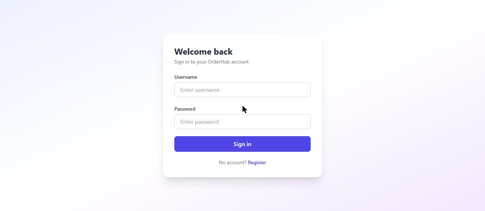

<div align="center">

# 🛍️ OrderHub

### A modern, responsive storefront and admin dashboard for the Order Management System

[](https://react.dev/)
[](https://vitejs.dev/)
[](https://tailwindcss.com/)
[](LICENSE)

**[🔗 Live Demo](https://order-management-frontend-kohl.vercel.app)** &nbsp;·&nbsp; **[⚙️ Backend API](https://github.com/rimjhimkrishna/order-management-api)**

</div>

---

<div align="center">
  
</div>

## Overview

OrderHub is the web client for the Order Management System REST API. It gives customers a clean shopping experience and gives admins full control over the catalog and order pipeline. The app is fully decoupled from the backend and communicates over a secured, token-based REST interface.

## ✨ Features

- **Secure authentication** — register and sign in with JWT, persisted across sessions
- **Product catalog** — searchable, sortable grid with real-time stock indicators
- **Shopping cart** — adjust quantities and place orders in a single click
- **Order tracking** — a visual status timeline (Pending → Confirmed → Shipped → Delivered) with one-tap cancellation
- **Admin dashboard** — create, edit, and remove products, manage order statuses, and monitor revenue and low-stock alerts at a glance
- **Polished UX** — responsive layout, loading skeletons, toast notifications, and protected routes

## 🧰 Tech Stack

| Layer | Technology |
| --- | --- |
| Framework | React 18 + Vite |
| Routing | React Router v6 |
| Styling | Tailwind CSS |
| HTTP | Axios (with JWT interceptor) |
| Hosting | Vercel |

## 🚀 Getting Started

#### 1. Install dependencies

```bash
npm install
```

#### 2. Configure the environment

Copy `.env.example` to `.env` and point it at your backend:

```
VITE_API_URL=http://localhost:8080/api/v1
```

#### 3. Run the dev server

```bash
npm run dev
```

The app will be available at `http://localhost:5173`.

## 🔌 Connecting to the Backend

OrderHub talks to the [Order Management API](https://github.com/rimjhimkrishna/order-management-api), a Spring Boot service. Run the backend locally (per its README) and it will be served on port 8080.

On login, the API returns a JWT which is stored client-side and automatically attached as an `Authorization: Bearer` header on every subsequent request. To allow the browser to reach the API, the backend's CORS configuration must include this app's origin (e.g. `http://localhost:5173` in development, and the deployed domain in production).

## 📁 Project Structure

```
src/
├── api/         # Axios client + endpoint services
├── components/  # Shared UI (Navbar)
├── context/     # Auth state provider
├── pages/       # Login, Register, Products, Orders, Admin
├── App.jsx      # Routes + route guards
└── main.jsx     # App entry
```

## 📦 Deployment

The app is deployed on Vercel and redeploys automatically on every push to `main`. A single-page rewrite rule keeps client-side routes working on hard refresh.

## 📄 License

Released under the [MIT License](LICENSE).
